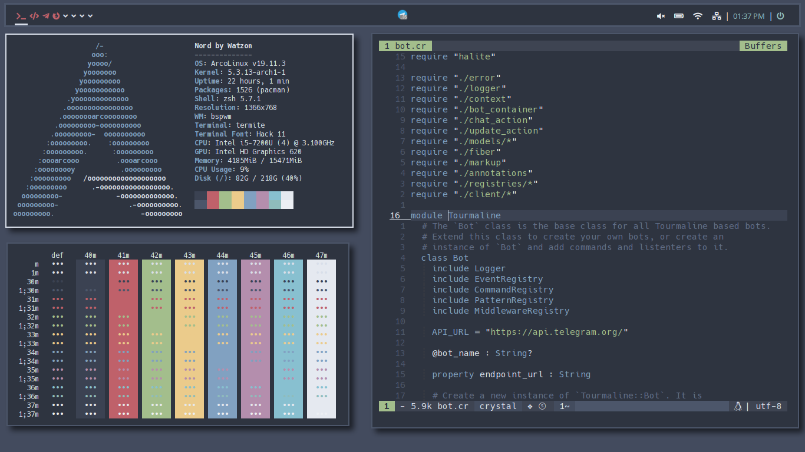

# dotfiles de watzon

These are my dotfiles. You can expect these to change constantly, as my preferences change constantly. For now I'm into Nord. See the below screenshot.



## Installing

I manage my dotfiles with [gnu stow](), a symlink farm manager. It's available in most linux distributions.

```
sudo apt install stow
sudo dnf install stow
sudo yum install stow
sudo pacman install stow
brew install stow
```

or clone it from source and build it yourself.
Once stow is installed, just cd into this repository and create symlinks using stow like this,

```
cd ~
git clone https://github.com/watzon/dotfiles
cd dotfiles
stow vim
```

It will symlink vim. If you wanna use this configurations for root user, use -t argument,

stow -t /root vim

Note: stow will only create a symlink if a config file doesn't already exist. You must delete/backup if there is a default config for a program.
